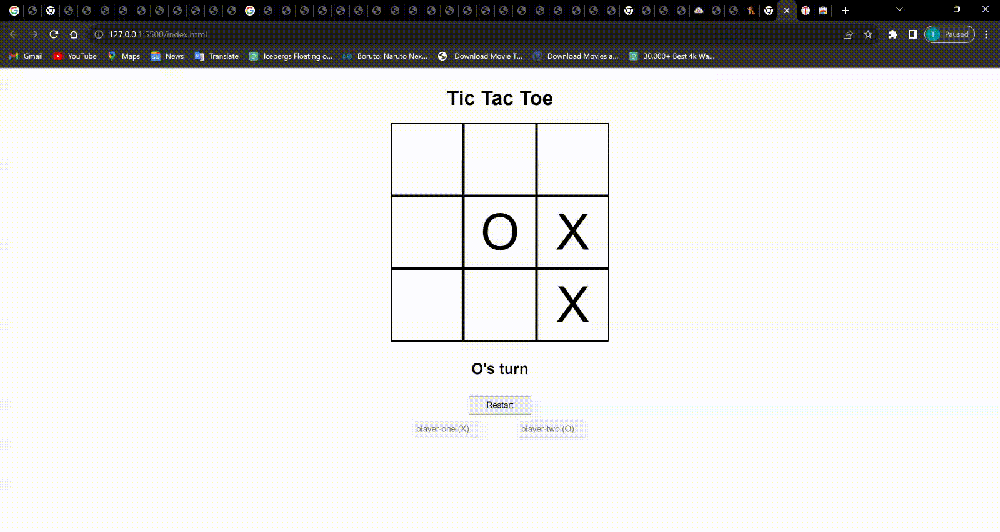

# Odin Project Tic Tac Toe

This Tic Tac Toe project is part of [The Odin Project](https://www.theodinproject.com/) curriculum. It serves as a way to assess my understanding of Immediately Invoked Function Expressions (IIFE) and modular patterns in JavaScript. Through this project, I've aimed to demonstrate my ability to create a functional and interactive game while employing a modular approach to code organization.

## Demo

## Technologies Used

- HTML
- CSS
- JavaScript

## Features

- **Modular Pattern**: The project employs the IIFE and modular pattern to encapsulate functions, creating a private scope for game logic and user interactions.

- **Two-Player Gameplay**: Players can take turns marking cells on a 3x3 grid, providing a classic Tic Tac Toe experience.

- **Game Progress Display**: The game displays the current player's turn and updates as the game progresses.

- **Restart Option**: A "Restart" button allows players to reset the game and start a new round.

## Future Modifications

While the current project demonstrates the foundational concepts of IIFE and modular patterns, there are several exciting modifications and improvements that could be made to enhance the game further:

- **Single-Player Mode**: Implement an AI opponent to allow players to play against the computer.

- **Improved Visual Design**: Enhance the game's visual appearance with CSS styles, animations, and a user-friendly interface.

- **Winning Animations**: Add visual feedback for winning moves, making the game more engaging and rewarding.

- **Game Statistics**: Track and display statistics, such as the number of games won by each player and the number of draws.

